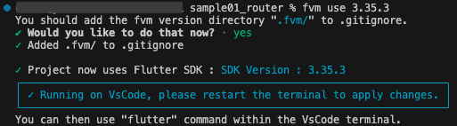
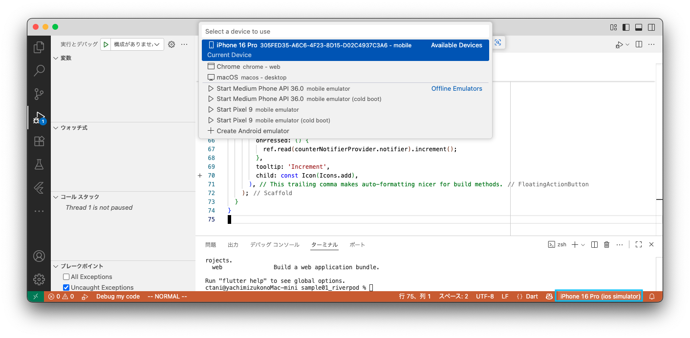
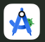

# flutter 開発メモ

1. [プロジェクト作成](#create_project)
2. [パッケージの導入方法](#get_packages)
3. [ローカライズ方法](#localization)
4. [プロジェクト実行方法](#run_project)
---

<div id="create_project"></div>

# 1. プロジェクト作成

## 1-1. 初回のみ実施すること

#### 1. グローバルに fvm 設定
ターミナルにて下記コマンド実施して、グローバル環境で flutter コマンド（`flutter create`コマンド）を実行できるようにする。  
flutterのバージョンはなんでも良いので、自マシンにインストールした中で最新のflutterバージョンあたりをインストールしとこう。


```bash
fvm global flutterバージョン（手持ちの中の最新バージョン指定しとこか）
# 例
fvm global 3.35.3
```

#### 2. fvm のパスを通しておく
ホームディレクトリ直下にある .zshrc (/Users/ユーザー名/.zshrc）に、下記１行を追記する。  
これにより、どのディレクトリにいても fvm コマンドが実行できるようになる。


```bash
export PATH="$HOME/fvm/default/bin:$PATH"
```

## 1-2. flutter プロジェクトの作成

#### 1. ターミナルにてプロジェクトフォルダを作成したいディレクトリを開く

#### 2. プロジェクト作成コマンド実行
手順1で移動したディレクトリにて、下記コマンドを実行して flutter プロジェクトを作成する。

```bash
flutter create ⚪︎⚪︎⚪︎⚪︎⚪︎　# ⚪︎⚪︎⚪︎⚪︎はプロジェクトフォルダ名
```

これでプロジェクト作成OK。

#### 3. VSCode で、手順２で作成したプロジェクトフォルダを開く

#### 4. VSCode 上のターミナルにて下記コマンドを実行して、使いたい flutter のバージョンを指定する。

```bash
fvn use X.XX.X # X.XX.Xは使いたいバージョン

# 例
fvn use 3.35.3
```

コマンドを実行すると以下のように聞かれるので `y` と入力する。  
Git登録除外設定ファイルである .gitignore ファイルに .fvm フォルダを追記する？って内容の問い。

```bash
You should add the fvm version directory ".fvm/" to .gitignore.
✔ Would you like to do that now? - yes/no
```

以下のように表示されればOK。

<div style="width=50%;">



</div>


#### 5. VSCode 上の flutter 拡張機能設定
VSCode 上の flutter 拡張機能設定のため、プロジェクトフォルダ直下にある .vscode フォルダ内に `settings.json` を作成する。  
作成した settings.json に、下記を記述する。  
`editor.formatOnSave ` 設定は、**勝手に dart の改行調整を無効化するため**の設定。自動でフォーマットして欲しい場合は true 設定にしてください。

```python
{
  "dart.flutterSdkPath": ".fvm/versions/3.36.0",
  "[dart]": {
    "editor.formatOnSave": false
  }
}
```

#### 6. プロジェクトに必須なパッケージ類(Riverpod関連)を導入
VSCode ターミナルにて、下記コマンドを実行して[Riverpod(後述)](#about_riverpod)関連のパッケージを導入する。  

```sh
flutter pub add flutter_riverpod riverpod_annotation
flutter pub add --dev riverpod_generator build_runner custom_lint riverpod_lint
```

上記を実行すると、プロジェクトフォルダ直下にある `pubspec.yaml` に以下のように追記される。  
各バージョンは、導入した時の最新バージョンになるはず。

```python
dependencies:
  #【略】
  flutter_riverpod: ^3.0.0　　　# Riverpod の基本機能を提供するパッケージ
  riverpod_annotation: ^3.0.0  # Provier のコード生成のためのアノテーションを提供
  #【略】
dev_dependencies:
  riverpod_generator: ^3.0.0   # Provier のコードを生成するためのパッケージ
  build_runner: ^2.7.1         # flutter gen のコード生成パッケージ
  custom_lint: ^0.8.0          # riverpod_lint 利用のために必要
  riverpod_lint: ^3.0.0        # Riverpod コード特有の問題を静的解析＆自動修正するパッケージ
```

これにて flutter プロジェクト作成作業完了！
iOSシミュレーターを起動した後

<div id="about_riverpod"></div>

##### Riverpod とは

Riverpod は、Flutter アプリで使う 状態管理ライブラリ。  
「アプリの中でデータをどう持って、どう画面に反映するか」をシンプルかつ安全に扱えるようにしてくれる。  
もともと Flutter 公式が推していた状態管理パッケージである Provider の改良版で、より安全で拡張性が高い。  
以下の特徴を持つ。

- **グローバルアクセス可能な状態管理**
  - どの画面からでも「同じ状態」にアクセスできる。  
例えば「ログインユーザー情報」「ショッピングカートの中身」などを、アプリ全体で共有できる。

- **型安全 & テストしやすい**
  - Dart の型システムを活かしているので、型ミスがすぐ分かる。
  - Provider（公式の元ライブラリ）よりテストが書きやすい設計。

- **依存関係の管理が簡単**
  - 「Aが更新されたらBも更新される」といった依存関係を自動で処理してくれる。
  - 開発者が手動で「通知する」「リスナーを解除する」といった管理をする必要が少なくなる。

- **StateNotifier や AsyncValue のサポート**
  - 非同期処理（API呼び出しなど）も簡単に扱える。
  - loading / data / error の状態をひとまとめにできるので、UI側もスッキリ書ける。

#### デフォルト main.dart を Riverpod 用に書き換えてみよう
デフォルトプログラムを Riverpod 仕様に書き換えると、以下のようになる。  
**書き換える前にデフォルト状態で実行してうまくいくことを確認してから**、書き換えよう。  
実行方法は、[プロジェクトの実行方法](#run_project)参照

```python
import 'package:flutter/material.dart';
import 'package:flutter_riverpod/flutter_riverpod.dart';

void main() {
  runApp(
    const ProviderScope(
      child: MyApp(),
    ),
  );
}

class MyApp extends StatelessWidget {
  const MyApp({super.key});

  // This widget is the root of your application.
  @override
  Widget build(BuildContext context) {
    return MaterialApp(
      title: 'Flutter Demo',
      theme: ThemeData(
        colorScheme: ColorScheme.fromSeed(seedColor: Colors.deepPurple),
      ),
      home: const MyHomePage(title: 'Flutter Demo Home Page'),
    );
  }
}

class CounterNitifier extends Notifier<int> {
  @override
  int build() => 0;

  void increment() {
    state = state + 1;
  }
}

final counterNotifierProvider = NotifierProvider<CounterNitifier, int>(() {
  return CounterNitifier();
});

class MyHomePage extends ConsumerWidget {
  const MyHomePage({super.key, required this.title});
  final String title;

  @override
  Widget build(BuildContext context, WidgetRef ref) {
    final counter = ref.watch(counterNotifierProvider);
    return Scaffold(
      appBar: AppBar(
        backgroundColor: Theme.of(context).colorScheme.inversePrimary,
        title: Text(title),
      ),
      body: Center(
        child: Column(
          mainAxisAlignment: MainAxisAlignment.center,
          children: <Widget>[
            const Text('You have pushed the button this many times:'),
            Text(
              '$counter',
              style: Theme.of(context).textTheme.headlineMedium,
            ),
          ],
        ),
      ),
      floatingActionButton: FloatingActionButton(
        onPressed: () {
          ref.read(counterNotifierProvider.notifier).increment();
        },
        tooltip: 'Increment',
        child: const Icon(Icons.add),
      ), // This trailing comma makes auto-formatting nicer for build methods.
    );
  }
}
```


---

<div id="get_packages"></div>

# 2. パッケージの導入方法

#### 1.　パッケージの追加
手順１でプロジェクト作成作業完了後作作成作業完了した後、**プロジェクトフォルダ直下にて下記コマンドを実行**する。  

```bash
flutter pub add ⚪︎⚪︎⚪︎⚪︎ # ⚪︎⚪︎⚪︎⚪︎は使いたいパッケージ名

# 例
flutter pub add go_router
```

これにて、プロジェクトフォルダ下直下にある pubspec.yaml ファイルに以下のように自動追記される。

```python
dependencies:
  flutter:
    sdk: flutter
  cupertino_icons: ^1.0.8
  go_router: ^16.2.2 # ←追加されてる

dev_dependencies:
  flutter_test:
    sdk: flutter
  flutter_lints: ^5.0.0
```

`dev_dependencies` セクションに追加したい場合（リリースビルドに含めたくない場合）は以下のように `--dev` オプションを付与する。

```bash
flutter pub add --dev ⚪︎⚪︎⚪︎⚪︎ # ⚪︎⚪︎⚪︎⚪︎は使いたいパッケージ名

# 例
flutter pub add --dev build_runner
```


#### 2. パッケージの導入
手順１で pubspec.yaml にパッケージ追加したら、下記コマンドを実行してパッケージを導入する。

```bash
flutter pub get
```

---

<div id="localization"></div>

# 3. ローカライズ方法

#### パッケージを導入
プロジェクトディレクトリ直下で下記コマンドを実行して、ローカライズに必要なパッケージを導入する。

```sh
flutter pub add flutter_localizations --sdk=flutter
flutter pub add intl:any
```

#### pubspec.yaml 設定
プロジェクトディレクトリ直下にある `pubspec.yaml` を開き、以下のように追記する。  
これは、コードジェネレータの設定のために必要なもの。

```python
# 省略
flutter:
  uses-material-design: true
  generate: true # ←追記
```

`pubspec.yaml` 追記後、生成されたコードをプロジェクトから参照できるように、以下のコマンドを実行する。

```sh
flutter pub get
```

#### ローカライズの構成ファイルを作成
プロジェクトディレクトリ直下に `l10n.yaml` という名前のファイルを作成する（文頭の文字は小文字のエル。２＆３番目は数字の10）

```python
arb-dir: lib/l10n
template-arb-file: intl_ja.arb
output-class: L10n
nullable-getter: false
```

#### arb ファイルを作成する
プロジェクトディレクトリ/lib ディレクトリ下に `l10n` ディレクトリを作成する。  
作成した `プロジェクトディレクトリ/lib ディレクトリ/l10n` ディレクトリ下に `app_ja.arb` ファイルを作成し、以下の例のように日本語定義ファイルを作成する。  
任意のキー値に対し、表示させたい日本語を定義していく。

```json
{
    "@@locale": "ja",
    "startScreenTitle": "Edit Snapアプリ",
    "@startScreenTitle": {
        "description": "アプリのタイトル"
    },
    "helloWorldOn": "こんにちは！\n今日は{date}です。",
    "@helloWorldOn": {
        "description": "挨拶と日付を表示します。",
        "placeholders": {
            "date": {
                "type": "DateTime",
                "format": "MEd"
            }
        }
    },
    "start": "開始する",
    "@start": {
        "description": "開始ボタンのラベル"
    }
}
```

#### コードジェネレイターの実行
arb ファイルを編集完了したら、下記コマンドでコードジェネレイターを実行する。  
※ 当コマンドは arb ファイル編集完了するたび実行して、編集内容を反映させること

```sh
flutter gen-l10n
```

#### ローカライズされたメッセージを適用
コードジェネレイターを実行したら、生成されたメッセージを以下の例(main.dart)のようにコードに反映させる。

```dart
import 'package:edit_snap/l10n/app_localizations.dart'; // 生成されたコードをインポート
import 'package:flutter/material.dart';

void main() {
  runApp(const MyApp());
}

class MyApp extends StatelessWidget {
  const MyApp({super.key});

  @override
  Widget build(BuildContext context) {
    return MaterialApp(
      localizationsDelegates: L10n.localizationsDelegates, // 対応言語の(今回は日本語のみ)の翻訳データを渡す
      supportedLocales: L10n.supportedLocales,             // 対応言語のリストを渡す
      title: 'Edit Snap',
      theme: ThemeData(
        colorScheme: ColorScheme.fromSeed(seedColor: Colors.teal),
        useMaterial3: true,
      ),
      home: StartScreen(),
    );
  }
}

// StartScreen クラス
class StartScreen extends StatelessWidget {
  const StartScreen({super.key});

  @override
  Widget build(BuildContext context) {
    final l10n = L10n.of(context); // L10nクラスのインスタンスを取得
    return Scaffold(
      appBar: AppBar(
        backgroundColor: Theme.of(context).colorScheme.inversePrimary,
        title: Text(l10n.startScreenTitle), // 対応するメッセージを生成コードから取得
      ),
      body: Center(
        child: Column(
          mainAxisAlignment: MainAxisAlignment.center,
          children: <Widget>[
            Text(
              l10n.helloWorldOn(DateTime.now()), // 対応するメッセージを生成コードから取得
              textAlign: TextAlign.center,
              style: Theme.of(context).textTheme.headlineSmall,
            ),
            ElevatedButton(
              child: Text(l10n.start), // 対応するメッセージを生成コードから取得
              onPressed: () {
                // ボタンが押されたときの処理
              },
            ),
          ],
        ),
      ),
    );
  }
}
```

#### App Store での表示言語を設定する
iOS ネイティブの対応言語を設定する。  
これは App Store に表示されるアプリの対応言語に影響する。  
`ios/Runner/Info.plist` を開き、`CFBundleLocalizations` キーの下に `ja` を追加する。

```xml
<?xml version="1.0" encoding="UTF-8"?>
<!DOCTYPE plist PUBLIC "-//Apple//DTD PLIST 1.0//EN" "http://www.apple.com/DTDs/PropertyList-1.0.dtd">
<plist version="1.0">
<dict>
    <!-- 省略 -->
    <key>CFBundleLocalizations</key>
    <array>
        <string>ja</string>
    </array>
    <!-- 省略 -->
</dict>
</plist>
```

これで、ローカライズ作業完了！  
サンプルは日本語のみ対応しているが、必要に合わせて言語追加すること

---

<div id="run_project"></div>

# 4. プロジェクト実行方法

#### 1.　シミュレーターを実行して選択
動かしたいシミュレーターを事前に起動（[iOSシミュレーター](#simulator_ios) または [Androidシミュレーター](#simulator_android)）した状態で、VSCodeウインドウ右下のシミュレーター選択をクリックして、シミュレーター選択する。

<div style="width=40%;">



</div>

<div id="simulator_ios"></div>

##### iOSシミュレーター起動方法

Launchpad から Simulator を起動。  
Simulator がインストールされていない場合、XCode をインストールしよう。  
XCode をインストールすれば、Simulator もインストールされる。  

###### 初回起動時
今まで一度も iOS シミュレーターを起動したことがない環境の場合、エラーが発生することがある。  
その場合はまず XCode を起動し、XCodeから下記手順で一度だけ iOS シミュレーターを起動することで解決する。  
XCodeメニュー「XCode」→「Open Developer Tool」→「Simulator」  

<div style="width=20%;">


</div>

<div id="simulator_android"></div>

##### Androidシミュレーター起動方法

Launchpad から Android Studio を起動。  
Android Studio がインストールされていない場合、下記手順でインストール＆ Android Emulator を作成しよう。  

1. Android Studioをインストールする。  
2. Android Studioメニュー「Tools」→「Device Manager」で Device Manager画面を起動し、Emulator が表示されているか確認する。  
Emulator の表示がなければ、Android Emulator が作成されていないので、下記手順で作成する。
3. Device Manager画面にて「Create virtual device...」ボタンをクリックして、Android Emulator作成ウインドウを表示する。
4. Android Emulator作成ウインドウにて、Emulatorの画面解像度や仮想ディスプレイサイズを選択し「Next」ボタンクリック。
5. Emulator の API レベルを選択。テキストでは API Level34 を選択だって・・・  
※ Flutter がサポートしている API レベルは[公式ドキュメントの「Supported development platforms」](https://docs.flutter.dev/reference/supported-platforms)で確認できる。
6. 選択した API レベルのシステムイメージをダウンロードして、選択し「Next」ボタンクリック。
7. 最後に Emulator の名前やその他の設定を行う画面に遷移するので「Finish」クリック。これで Android Emulator の作成完了！


<div style="width=20%;">



</div>

#### 2. プロジェクト実行
VSCodeターミナルにて、下記コマンドを実行してプロジェクト実行。

```sh
flutter run
```

---

<div id="debug"></div>

# 5. デバッグ実行方法 

#### 1.　シミュレーターを実行して選択
動かしたいシミュレーターを事前に起動する。  
方法は[4. プロジェクト実行方法](#run_project) でのシミュレーター実行すると同じ。

#### 2. デバッグ実行

1. VSCode の左側バーの「実行とデバッグ」ボタンをクリック。
2. エクスプローラーペインがデバッグペインに変わるので、「実行とデバッグ」ボタンをクリックすればデバッグ開始。


