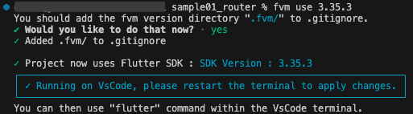

# flutter 開発メモ

1. [プロジェクト作成](#create_project)

---

<div id="create_project"></div>

# 1. プロジェクト作成

## 1-1. 初回のみ実施すること

##### 1. グローバルに fvm 設定
ターミナルにて下記コマンド実施して、グローバル環境で flutter コマンド（`flutter create`コマンド）を実行できるようにする。  
flutterのバージョンはなんでも良いので、自マシンにインストールした中で最新のflutterバージョンあたりをインストールしとこう。


```bash
fvm global flutterバージョン（手持ちの中の最新バージョン指定しとこか）
# 例
fvm global 3.35.3
```

##### 2. fvm のパスを通しておく
ホームディレクトリ直下にある .zshrc (/Users/ユーザー名/.zshrc）に、下記１行を追記する。  
これにより、どのディレクトリにいても fvm コマンドが実行できるようになる。


```bash
export PATH="$HOME/fvm/default/bin:$PATH"
```

## 1-2. flutter プロジェクトの作成

##### 1. ターミナルにてプロジェクトフォルダを作成したいディレクトリを開く

##### 2. プロジェクト作成コマンド実行
手順1で移動したディレクトリにて、下記コマンドを実行して flutter プロジェクトを作成する。

```bash
flutter create ⚪︎⚪︎⚪︎⚪︎⚪︎　# ⚪︎⚪︎⚪︎⚪︎はプロジェクトフォルダ名
```

これでプロジェクト作成OK。

##### 3. VSCode で、手順２で作成したプロジェクトフォルダを開く

##### 4. VSCode 上のターミナルにて下記コマンドを実行して、使いたい flutter のバージョンを指定する。

```bash
fvn use 3.35.3
```

コマンドを実行すると以下のように聞かれるので `y` と入力する。  
Git登録除外設定ファイルである .gitignore ファイルに .fvm フォルダを追記する？って内容の問い。

```bash
You should add the fvm version directory ".fvm/" to .gitignore.
✔ Would you like to do that now? - yes/no
```

以下のように表示されればOK。

<div style="width=50%;">



</div>


##### 5. VSCode 上の flutter 拡張機能設定
VSCode 上の flutter 拡張機能設定のため、プロジェクトフォルダ直下にある .vscode フォルダ内に `settings.json` を作成する。  
作成した settings.json に、下記を記述する。

```python
{
  "dart.flutterSdkPath": ".fvm/versions/3.36.0"
}
```

これにて flutter プロジェクト作成作業完了！

