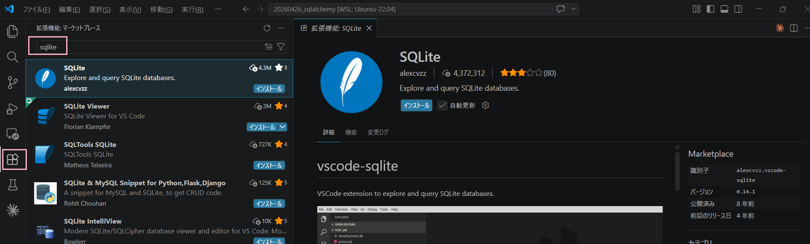
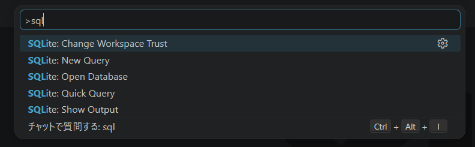
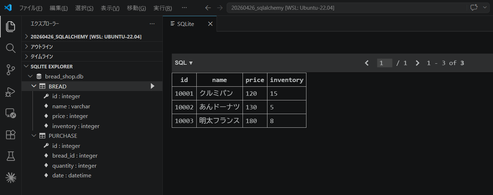
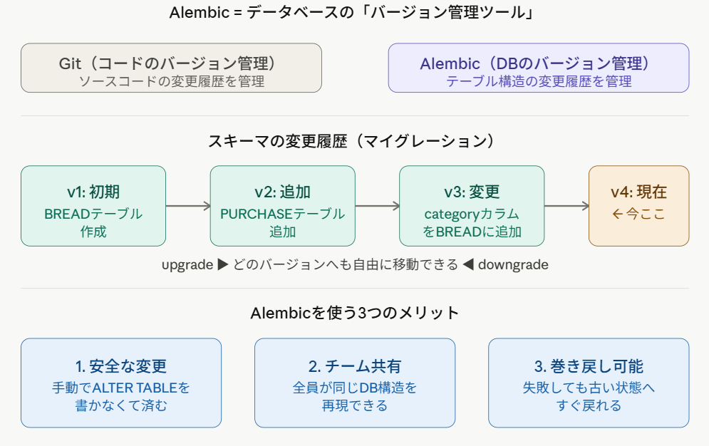

# QSLALchemy

1. [SQLite CLI のインストール](#install_sqlite_cli)
1. [SQLAlchemy のインストール](#install_sqlalchemy)
1. [SCode で sqlite を操作する方法](#fsqlite_with_vscode)
1. [Alembic](#alembic)
1. [サンプルのテーブル構造](#sample_table_structures)
1. [サンプルのファイル構成](#sample_file_structures)

---

<div id="install_sqlite_cli"></div>

## SQLite CLI のインストール

1. パッケージリストの更新

```bash
sudo apt update
```

2. SQLite3 のインストール

```bash
sudo apt install sqlite3
```

3. インストール確認

```bash
sqlite3 --version
```

---

<div id="install_sqlalchemy"></div>

## SQLAlchemy のインストール

1. Python仮想環境内で SQLAlchemy をインストール

```bash
pip install sqlalchemy
```

2. インストール確認

```bash
pip list | grep SQLAlchemy
```

---

<div id="sqlite_with_vscode"></div>

## VSCode で sqlite を操作する方法
VScode 上で SQlite を見るには「sqlite3」という拡張機能を使用する。  
※ VScodeを使わなくても `DB Browser for SQLite` という素晴らしいツールもあるので、そちらを使ってもOK!

### VSCode の拡張機能「sqlite3」インストール方法
下図桃枠の左メニュー「拡張機能」アイコンクリック → [拡張機能とマーケットプレイス]検索ボックスで「sqlite」と入力して拡張機能の検索実行する。  
検索にヒットした上位に、拡張子 `alexcvzz.vscode-sqlite` である `SQLite` 拡張機能をインストール。

<div style="width=50%;">



</div>

### VSCode の拡張機能「sqlite3」使い方

「F1」（or「Ctrl+Shift+P」）キー押下でコマンドパレットを開いて「sql」と入力すると、下図のように sqlite3 関連のコマンド候補が出てくる。

<div style="width=50%;">



</div>

検索結果の「SQLite: Open Database」を選択し、確認したいデータベースファイルを選択する。

画面上は特になにも起こっていないように見えるが、実はエクスプローラータブをよく見ると下図のように `SQLITE EXPLORER` という項目が増えており、ここに各テーブルとカラムが表示されている。  
テーブルに登録されているデータを見たい場合は、各テーブル名の横にある「`▶`」をクリックすると確認できる。

<div style="width=50%;">



</div>

※ VScodeを使わなくても `DB Browser for SQLite` という素晴らしいツールもあるので、そちらを使ってもOK!


---

<div id="alembic"></div>

## Alembic
### Alembic とは
**Alembicとは、データベースの「Git」**。
コードをGitで管理するように、**テーブルの構造（スキーマ）の変更履歴をファイルで管理できるツール**。

<div style="width=50%;">



</div>


#### 具体的な問題を考えてみる
今回作った bread_shop.db に、後から「パンのカテゴリ（category）カラムを追加したい」となったとする。  
Alembicなしでは、手動で次のようなSQLを実行しなければならない。

```
sqlALTER TABLE BREAD ADD COLUMN category TEXT;
```

この方法の問題点は、「誰がいつ変更したか」が記録に残らず、チームで開発していると他のメンバーのDBとズレが生じてしまうこと。

#### Alembic の使い方
以下のように、変更内容がファイルとして保存されるので、Gitと同じ感覚でバージョン管理できる。

```bash
# モデル変更後にマイグレーションファイルを自動生成
alembic revision --autogenerate -m "add column X"

# マイグレーションを適用
alembic upgrade head

# もし失敗したら、1つ前の状態に戻す
alembic downgrade -1

# 現在のバージョン確認
alembic current
```

※ 学習段階では、まだ急いで Alembic を導入する必要はない。  
ある程度 SQLAlchemy に慣れてから導入すればよい。

---

<div id="sample_table_structures"></div>

## サンプルのテーブル構造

### パンテーブル: BREAD

| 名前       | 型      | 備考         |
| ---------- | ------- | ----------- |
| id         | INTEGER | PRIMARY KEY |
| name       | TEXT    |             |
| price      | INTEGER |             |
| inventory  | INTEGER |             |

### 売上テーブル: PURCHASE

| 名前       | 型      | 備考         |
| ---------- | ------- | ----------- |
| id         | INTEGER | PRIMARY KEY |
| bread_id   | INTEGER |             |
| quantity   | INTEGER |             |
| date       | DATE    |             |


## サンプルデータ

### パンテーブル: BREAD
10001, "クルミパン", 120, 15  
10002, "あんドーナツ", 130, 5  
10003, "明太フランス", 180, 8  

### 売上テーブル: PURCHASE
100001, 10002, 1. "2026-04-01 11:45:12.111"  
100002, 10003, 3. "2026-04-01 11:53:22.222"  
100003, 10001, 2. "2026-04-01 12:01:33.333"  
100004, 10003, 4. "2026-04-02 11:44:44.444"  

---

<div id="sample_file_structures"></div>


## サンプルのファイル構成

```
.
├── db/                 --- 共通DB層（どのスクリプトからも再利用可能）
│   ├── __init__.py     --- パッケージ公開 API + イベントリスナー登録
│   ├── base.py         --- DeclarativeBase のみ（循環 import 防止）
│   ├── engine.py       --- create_engine / SessionFactory
│   ├── models.py       --- Bread / Purchase モデル定義
│   ├── events.py       --- 在庫自動デクリメント（after_insert リスナー）
│   └── session.py      --- get_session コンテキストマネージャ
│
├── create_tables.py    --- テーブル作成（初回セットアップ用）
├── insert_data.py      --- サンプルデータ登録（冪等・毎回リセット）
├── query.py            --- データ確認・売上集計クエリ
│
├── alembic.ini         --- Alembic 設定ファイル
└── alembic/
    ├── env.py          --- db.models を参照して autogenerate 対応
    ├── script.py.mako  --- マイグレーションファイルのテンプレート
    └── versions/       --- 生成されたマイグレーションファイル置き場
```

### 各機能のポイント

| 機能 | 実装場所 | 仕組み |
| ---- | ------- | ----- |
| 在庫自動デクリメント | db/events.py | @event.listens_for(Purchase, "after_insert") — flush 中に同一 connection で UPDATE を発行、同一トランザクション内で完結 |
| 共通セッション管理 | db/session.py  | get_session() は他のどのスクリプトからも from db import get_session で利用可能 |
| 冪等な insert | insert_data.py | 毎回 DELETE → INSERT の順でリセットするため何度実行しても在庫値が正しくなる |
| Alembic autogenerate | alembic/env.py | target_metadata = Base.metadata を設定済み。  alembic revision --autogenerate -m "..." でモデルとDBの差分を自動検出 |