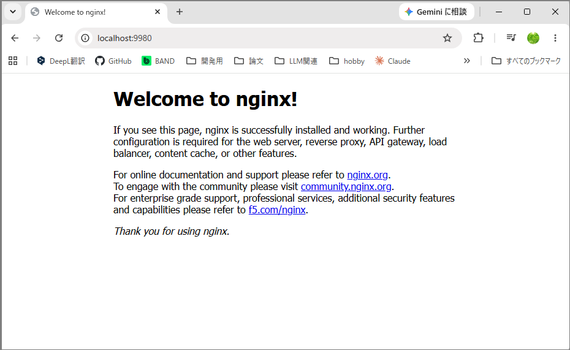

# 各種サーバー構築めも
1. [nginx](#nginx)


---

# nginx

## 1. セットアップ

### 1-1. nginx 導入・運用に必要なライブラリ群をインストール
Ubuntu のパッケージ管理コマンド（apt）を使って、開発用パッケージ（-dev がつくもの）をインストールする。

##### 各ライブラリの役割（なぜ必要か）
- libpcre3-dev：HTTP rewrite モジュールに必要（URLの正規表現処理）。
- zlib1g-dev：コンテンツを圧縮して高速配信する gzip モジュールに必要。
- libssl-dev：サイトを常時HTTPS化（SSL/TLS暗号化）する http_ssl_module に必要。

Ubuntu ターミナルで以下を実行。

```bash
cd ~
sudo apt update
sudo apt install -y build-essential libpcre3 libpcre3-dev zlib1g zlib1g-dev libssl-dev
```

### 1-2. nginx をダウンロード
* ネットから [nginx公式HP](https://nginx.org/en/download.html)より最新版のtar.gzファイル(Mainline version)をダウンロードする。  
今回は `nginx-1.31.2.tar.gz` をダウンロード。


#### 1-3. nginx を導入
* ダウンロードしたtar.gzファイルを WSL側の ~（/home/ユーザー名）は以下の任意のディレクトリへ配置し、下記コマンドで tar.gz ファイルを解凍する。  
下記例では、/home/ユーザー名/web_server (Windows 側でいうと \\wsl$\Ubuntu-22.04\home\ユーザー名\web_server ) に tar.gz を配置。

```bash
cd ~/web_server
tar -xzf nginx-1.31.2.tar.gz
# nginx-1.31.2.tar.gz はもう不要なので、削除してOK
rm -xzf nginx-1.31.2.tar.gz
```

* 解凍後、下記コマンドを実行。HTTPS（SSL）対応のオプション（--with-http_ssl_module） も一緒に付けておく。

```bash
cd ./nginx-1.31.2/
./configure --prefix=/home/ユーザー名/web_server/nginx --with-http_ssl_module
```

最後の1行が `creating objs/Makefile` で終わっていれば、次の make コマンドを受け付ける準備完了。

##### configure の checking でいくつか not found が出るが、問題ない
この ./configure というスクリプトは、「このLinux（OS）環境にはどんな機能や部品が備わっているか？」を片っ端からテストしている。  
Linuxと一口に言っても、Ubuntu、CentOS、FreeBSD、macOSなど様々な種類があり、カーネル（OSの核心部）のバージョンによって使えるシステムコール（OSの機能）が異なる。  
ログに出ていた not found の例を見てみると：

- checking for sys/filio.h ... not found  
👉主に対象がBSD系のOS（FreeBSDなど）で使われる古いファイル。Ubuntu (Linux) には不要なので not found で正解。

- checking for kqueue ... not found  
👉macOSやFreeBSDが持つ高速な通信仕組み。Ubuntu (Linux) では代わりに epoll という仕組みを使うため、ログの前半で checking for epoll ... found となっている時点でOK、問題なし。

- checking for PCRE2 library ... not found  
👉最新の PCRE2 は入っていなかったけれど、その直後に checking for PCRE library ... found となり、従来のPCREライブラリが見つかったためクリアしている。

このように、「これがあれば使うけど、無いなら別の標準的な機能を使うよ」というチェック項目が多いため、not found がたくさん並ぶのは正常な挙動。


##### ソースコードをコンパイルして実行ファイルを生成

```bash
make
```

make がエラーなく終わったら、最後に以下を実行してインストール完了！

```bash
make install
```

* ./configure コマンド実行時 --prefix オプションで指定したフォルダに nginx がインストールされていることを確認できればOK。

###### 1-3. ポート番号とドキュメントルートを設定

* `home/ユーザー名/web_server/nginx/conf/nginx.conf` を nano で開き、ポート番号を設定する。  
* ドキュメントルートを任意のフォルダに変更したければ、ドキュメントルートも設定する。

```
server {
    listen       9980;                    # ← ★ポート番号を空いている任意の変更する！デフォルト＝80
    server_name  localhost;

    #access_log  logs/host.access.log  main;

    location / {
        root   html;                        # ← ドキュメントルート。デフォルトは home/ユーザー名/web_server/nginx/html
        index  index.html index.htm;
    }
```


## 2. nginx 起動方法
* nginx.conf を保存後、下記コマンドを実行することで nginx サーバー起動。

```bash
cd /home/ユーザー名/web_server/nginx/sbin
./nginx

# または
/home/ct1485/web_server/nginx/sbin/nginx
```

特にエラーメッセージが出ずに、スッと次の入力プロンプトに戻れば無事に起動してるはず。

### 2-1. ブラウザから確認する
* `home/ユーザー名/web_server/nginx/html` フォルダ下に、デフォルトでサンプル index.html が入っている。  
* Windows 側でブラウザを開き、アドレスバーに以下を入力してアクセスしてみる。

```bash
http://localhost:9980/
# アドレスが 172.19.132.72 で起動させた場合
http://172.19.132.72:9980/
```

下図のように、デフォルトのサンプル index.html が表示されればOK!



## 3. 各種コマンド

| 動作             | コマンド        |
| ---------------- | --------------- |
| nginx 起動       | nginx           |
| nginx 終了       | nginx -s stop   |
| 設定の再読み込み | nginx -s reload  |

---
